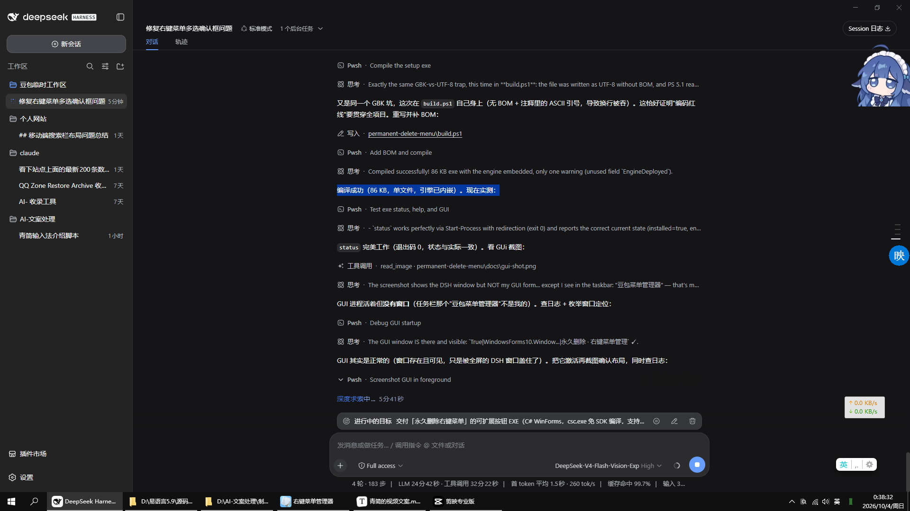

# 永久删除右键菜单

`permanent-delete-menu` · 给 Windows 资源管理器加一个「永久删除（不进回收站）」右键菜单项：**一键添加、一键移除**，多选也只弹一个确认框。

[](LICENSE)
[](#下载与安装)
[](docs/ARCHITECTURE.md)
[](#从源码构建)

<!-- CI 还没在 GitHub Actions 上跑过，先不放构建徽章（不放假的）。第一次 CI 变绿后取消下面这行的注释：
     [](https://github.com/2604290100/permanent-delete-menu/actions/workflows/ci.yml)
-->

---

## 这是什么 / 解决什么问题

资源管理器**原生没有「永久删除」**：右键只有「删除」（进回收站），要绕过回收站得按 `Shift+Delete`，而它常在没有提示的情况下就把文件抹掉。本项目补上这个缺口，同时解决第二个问题：

- **菜单项**：往 `HKLM\SOFTWARE\Classes\AllFilesystemObjects\shell\PermanentDelete` 注册静态动词，右键菜单底部出现「永久删除（不进回收站）」，**文件和文件夹同时生效**。
- **多选只弹一个框**：资源管理器对静态动词是**逐个调用**的（实测选中 36 个文件夹 = 36 个进程，日志里 36 次 `START n=1`）。引擎用「命名互斥体 + 队列 + 自适应静默窗口」合并成**一次**确认、**一次**删除。

交付物是约 86 KB 的单文件 exe：双击是界面，带参数是命令行。引擎（约 1000 行 PowerShell + 80 行 VBS）以明文脚本部署在 `%LOCALAPPDATA%`，随时可读——原因见[架构说明](docs/ARCHITECTURE.md)。

## 它跟 `Shift+Delete` 有什么不同

| | `Shift+Delete` | 本工具 |
| --- | --- | --- |
| 确认 | 依赖「显示删除确认对话框」设置，**默认是关的** → 常常按下去就没了 | **每次都弹**确认框，列出全部待删路径 |
| 默认按钮 | ——（没有框） | **「取消」**：回车 = 不删 |
| 多选 | 没有"先看清单再决定"这一步 | 合并成一次确认、一次执行，删前可核对清单 |
| 危险目标 | 无判断 | 拒绝盘符根（`C:\`）与 UNC 共享根（`\\server\share`） |

两者都不可恢复，区别是**本工具强制确认一次、并先把要删的东西列出来**。嫌确认麻烦，可勾「只在按住 Shift 时的扩展菜单里显示」，触发方式与 `Shift+Delete` 一致，确认框仍在。

## 下载与安装

1. 到 [Releases](https://github.com/2604290100/permanent-delete-menu/releases)（[最新版](https://github.com/2604290100/permanent-delete-menu/releases/latest)）下载 **`PermanentDeleteSetup.exe`**：单文件约 86 KB，**引擎脚本已内嵌**；**不需要 .NET SDK**，只用系统自带的 PowerShell 5.1 与 .NET Framework 4.x。附件另有 `PermanentDeleteSetup-package.zip`（源码 + 测试 + 文档）与 `SHA256SUMS.txt`。
2. **先校验再运行**：

   ```powershell
   Get-FileHash .\PermanentDeleteSetup.exe -Algorithm SHA256
   ```

3. 双击 → 弹一次 UAC（写 `HKLM` 必须管理员）→ 点「**添加 / 修复右键菜单**」。
4. 选中文件或文件夹右键，菜单底部即「永久删除（不进回收站）」。
5. 不想用了再打开 exe 点「**移除右键菜单**」：动词键被删（删前自动 `reg.exe export` 备份），引擎脚本与日志默认保留。

> **exe 未签名**，可能出现 SmartScreen「未知发布者」提示或被 HIPS（火绒等）拦截——"写注册表 + 永久删除文件"与恶意软件行为高度重合。请只从本仓库 Releases 下载并校验 SHA256。风险见 [SECURITY.md](SECURITY.md) §4。

## 界面



- **状态区**：引擎脚本是否已部署、注册表是否已安装（有历史项会告警）、**菜单可见性**（用 Shell 真的枚举动词，不是只看注册表）、有无隐藏标志；右上角「重新检测」。
- **选项区**（点「添加 / 修复右键菜单」才生效）：菜单文字、图标、「只在按住 Shift 时的扩展菜单里显示」。
- **操作区**：「添加 / 修复右键菜单」「移除右键菜单」「测试一下」（真的弹一次确认框，验证整条链路）、「打开日志目录」「查看引擎日志」。
- 下方是安装器日志的最近若干行。GUI 只做展示与按钮，**不直接碰注册表**。

## 命令行用法

GUI 按钮走的就是这套命令，所以两者行为一致：

| 命令 | 作用 | 退出码 |
| --- | --- | --- |
| `status` | 输出 `key=value` 状态，含 Shell 实测可见性 | `installed=true` 时 0，否则 1 |
| `verify` | 只做菜单可见性自检 | 可见时 0，否则 1 |
| `install` | 部署脚本 + 写动词 + 清隐藏标志 + 清历史项 | 0 成功 / 1 有问题 |
| `uninstall` | 备份并删除动词键（脚本默认保留） | 0 成功 / 1 有问题 |
| `help` | 打印用法（`h` / `?` 同义；注意 `-h` 不是命令，会被当成未知开关） | 0 |

| 开关 | 作用 |
| --- | --- |
| `--quiet` / `-q` | 明细只写进 `setup.log`（GUI 用的就是这个模式） |
| `--extended` | 只在按住 Shift 的扩展菜单里显示 |
| `--no-extended` | 回到常规菜单 |
| `--menu-text=文字` | 自定义菜单文字（默认「永久删除（不进回收站）」） |

**退出码**：`0` 成功；`1` 有问题（看 `setup.log`）；`2` 参数错误；`5` 用户取消 UAC 或提权失败。

> **它是 GUI 子系统程序**（所以永远不闪黑窗），PowerShell 里用 `&` 调用**不会等待、也拿不到输出**：

```powershell
Start-Process -FilePath .\bin\PermanentDeleteSetup.exe -ArgumentList 'status' -Wait -NoNewWindow
```

`status` 各字段含义见[排障手册 §0](docs/TROUBLESHOOTING.md)。

## 它是怎么做到"多选只弹一个确认框"的

资源管理器对静态动词**逐项调用**：实测选中 36 个文件夹，日志里 36 次 `START n=1`、35 次 `HANDOFF n=1`。`MultiSelectModel=Player` **对静态动词不生效**。引擎的办法：

```text
36 次调用 ──▶ 第 1 个进程抢到命名互斥体 ──▶ 成为主实例
              其余 35 个把路径写进队列后立刻退出（HANDOFF）
              主实例：反复等"连续 700 ms 没有新条目" ──▶ 合并成一个批次
                     ──▶ 只弹一个确认框 ──▶ 只删一次
```

窗口**自适应**：每来一个新请求顺延 700 ms，硬上限 8 秒；等待超 1.5 秒先弹「正在汇总选中的项目…」。残留队列的判据是**互斥体**而非时间戳——抢到互斥体即无活实例，启动时清空残留，绝不重放旧路径。

完整调用链与每条决策的实测依据见 [docs/ARCHITECTURE.md](docs/ARCHITECTURE.md)。

## 安全性

删除**不可恢复**，所以引擎做了这些保护：

| 保护 | 说明 |
| --- | --- |
| 拒绝危险目标 | 盘符根（`C:\`）与 UNC 共享根（`\\server\share`）只记日志、不弹框 |
| 联接点只删链接 | `ReparsePoint` 只删链接本身，**绝不递归进目标**（测试验证目标数据仍在） |
| 嵌套折叠 | 同时选父目录与其内部项时只保留父目录 |
| 清属性再删 | 只读/隐藏/系统属性先清（不改 ACL、不夺所有权） |
| 超长路径 | 自动加 `\\?\` 前缀交给 Unicode API |
| 默认安全 | 确认框默认按钮是**取消**（回车 = 取消），系统弹窗默认同样选"否" |
| 不猜路径 | 参数文件只认 `%TEMP%\permdelete_args_*.pdl`；被空格拆散的路径只在"拼回来确实存在"时才合并 |
| 删前备份 | 卸载/清理注册表键前 `reg.exe export` 到 `backup-*.reg` |
| 不越权、不联网 | 失败只报错，不提权不强拆；无任何网络调用与遥测 |

日志（排障看第二个），超 2 MB 轮转成 `.1`：

```text
%LOCALAPPDATA%\PermanentDelete\setup.log     安装器：安装/卸载/提权/注册表操作
%LOCALAPPDATA%\PermanentDelete\delete.log    引擎：合并、确认与逐个删除结果
```

**信任边界与已知风险**（未签名、引擎脚本在用户可写目录等）见 [SECURITY.md](SECURITY.md)。

## 常见问题

**菜单看不到** —— 跑 `status` 看 `fileVisible` / `folderVisible`，别只看注册表。最常见是右键菜单管理工具（如 ContextMenuManagerPlus）的"审核"给新动词写了隐藏标志：`hideFlags=` 非空即是。点「添加 / 修复」会清除，但**要在那类工具里放行这一项**。→ [§1.2](docs/TROUBLESHOOTING.md)

**点了没反应** —— 看 `delete.log`：无 `START` = Shell 没执行到脚本（脚本丢了或被杀软拦）；有 `START` 无 `CONFIRM` = 窗体没显示出来（引擎有降级，日志留 `UI-FALLBACK`）。→ [§2](docs/TROUBLESHOOTING.md)

**多选弹了多个框** —— 一次动作应只有**一个** `BATCH` + 一个 `CONFIRM`。若有两个，多半是历史项 `staleKeys` 非空（早期注册在 `*\shell` 与 `Directory\shell` 两处）；点「添加 / 修复」自动清理。→ [§3](docs/TROUBLESHOOTING.md)

**杀软 / HIPS 拦截** —— 无签名，敏感行为必然被拦。把 exe 加信任；引擎侧需放行 `wscript.exe` / `powershell.exe`。→ [§2.3](docs/TROUBLESHOOTING.md)

**卸载后有残留** —— `installed=false`、`staleKeys=` 空、`hideFlags=` 空才算干净。→ [§6](docs/TROUBLESHOOTING.md)

提 issue 前请先看 [docs/TROUBLESHOOTING.md](docs/TROUBLESHOOTING.md)，并附 `status` 完整输出与日志片段（**贴前把用户名打码**）。

## 从源码构建

```powershell
git clone https://github.com/2604290100/permanent-delete-menu.git
cd permanent-delete-menu
powershell -ExecutionPolicy Bypass -File build.ps1             # 产物 bin\PermanentDeleteSetup.exe
powershell -ExecutionPolicy Bypass -File build.ps1 -Package    # 额外打一个发布 zip
```

| 项目 | 要求 |
| --- | --- |
| 操作系统 | Windows 10 / 11（64 位）。**只在 Windows 10 上实测过** |
| 编译器 | .NET Framework 4.x 自带的 `csc.exe`（`build.ps1` 自动找）。**不需要 .NET SDK** |
| 引擎运行时 | Windows PowerShell **5.1**（系统自带，右键实际走的就是它） |
| 依赖 | **零**：无 NuGet 包、无第三方 exe/dll |

两条必须知道的规则（详见 [CONTRIBUTING.md](CONTRIBUTING.md) §4）：

1. **引擎脚本是内嵌资源**：`engine/` 下两个脚本被 `build.ps1` 以 `/resource:` 嵌进 exe，**改了必须重新编译**，否则右键跑的仍是旧脚本。
2. **编码红线**：引擎 `.ps1` 必须 UTF-8 **带 BOM**、`.vbs` 必须**纯 ASCII**、`.cs` 要带 BOM。违反后果是"静默毁功能"（中文引号读坏 / 注释吞换行）。改完跑 `powershell -File tools\Test-Encoding.ps1` 体检。

## 测试

共 **116 项**，一条命令跑完全部（编码检查 → 安装器 → 引擎回归 → 端到端）：

```powershell
# 需要管理员 PowerShell
powershell -NoProfile -ExecutionPolicy Bypass -File tests\Test-All.ps1
#   -SkipE2E   无交互桌面时用（CI runner 必须加）
#   -SkipExe   不想动本机右键菜单时用
```

| 套件 | 项数 | 需要 | 测什么 |
| --- | --- | --- | --- |
| `tools/Test-Encoding.ps1` | —— | —— | BOM / 纯 ASCII / 合法 UTF-8 / 无本机绝对路径 |
| `tests/Test-SetupExe.ps1` | 41 | 管理员 | 装/卸/幂等、隐藏标志清除、历史项清理、部署脚本与源码**字节一致**、Shell 实测可见性 |
| `tests/Test-Engine-Regression.ps1` | 56 | 管理员 + 先装一次 | 多选合并、只读文件、联接点、超长路径、嵌套、盘根拒绝、取消、陈旧队列、伪造参数文件 |
| `tests/Test-Engine-E2E.ps1` | 11 | 管理员 + **交互桌面** | 用 `Shell.Application` 触发真实动词，验证"只弹一个框 / 取消不删 / 确认才删" |

- 全部在 `%TEMP%` 沙箱内，不碰真实文件。
- **端到端会真的弹确认框**，无交互会话里跑不了：[ci.yml](.github/workflows/ci.yml) 只跑编码检查 + 41 + 56 项，端到端请在本地手动跑。
- 前置条件与写测试的经验见 [CONTRIBUTING.md](CONTRIBUTING.md) §5。

## 仓库结构

```text
permanent-delete-menu/
├─ src/                          C# 源码（C# 5 语法，系统自带 csc.exe 编译）
│   ├─ Program.cs                入口：无参数 → GUI，有参数 → CLI
│   ├─ MainForm.cs               GUI：状态 + 添加/修复 + 移除 + 测试
│   ├─ Commands.cs               CLI 命令、提权、状态文本
│   ├─ MenuRegistry.cs           注册表动词读写、隐藏标志与历史项清理、备份
│   ├─ Engine.cs                 引擎抽象 IEngine + PowerShell/VBS 实现
│   ├─ Native.cs                 P/Invoke + 用 Shell.Application 实测可见性
│   ├─ AppPaths.cs               路径与常量（加功能先看这里）
│   ├─ Settings.cs               setup.ini 选项
│   ├─ Logger.cs                 安装器日志
│   └─ AssemblyInfo.cs           版本信息
├─ engine/                       引擎真源，内嵌进 exe（改了必须重编）
│   ├─ PermanentDelete.ps1       主脚本：合并、确认框、删除引擎（UTF-8 带 BOM）
│   └─ launch_perm_delete.vbs    隐藏控制台启动器（纯 ASCII）
├─ tests/                        三套测试 + Test-All.ps1 一键跑全套
├─ tools/Test-Encoding.ps1       编码红线检查（本地与 CI 共用）
├─ assets/                       app.ico / app.manifest（asInvoker，按需提权）
├─ docs/                         ARCHITECTURE.md、TROUBLESHOOTING.md、界面截图
├─ skill/permanent-delete-menu/  DSH skill：排障顺序与开发惯例
├─ .github/                      CI / Release 工作流、issue 与 PR 模板
├─ build.ps1                     一键编译（含编码检查与内嵌资源自检）
├─ CONTRIBUTING.md               贡献指南（含四条硬性红线）
├─ SECURITY.md                   安全策略与信任边界
├─ CHANGELOG.md                  更新日志
└─ LICENSE                       GPL-3.0 全文
```

`bin/` 是编译产物，**不入仓**（成品走 Releases）。运行时文件（脚本、日志、设置、`.reg` 备份）都在 `%LOCALAPPDATA%\PermanentDelete\` 下。

## 许可

以 **[GPL-3.0-or-later](LICENSE)** 发布，版权署名 `2604290100`。选 GPL 的原因：这是"写注册表 + 永久删除文件"的工具，**改个名字闭源再分发**是最容易发生的滥用，GPL 要求再分发者必须交出源码（含他自己改的部分）。你可以改它、用它、商用，只要遵守 GPL。

**零第三方依赖**：exe 只用系统自带的 `csc.exe` 编译，引擎只用系统自带的 PowerShell 5.1 与 `wscript.exe`——没有 NuGet 包、没有第三方 exe/dll，所以不存在额外的第三方许可声明。图标与截图均为本项目自行产出。

## 贡献与相关

- 改代码：先读 [CONTRIBUTING.md](CONTRIBUTING.md)。
- 安全问题：**不要开公开 issue**，走 [SECURITY.md](SECURITY.md) 的私密渠道。
- 版本变化：[CHANGELOG.md](CHANGELOG.md)；为什么这样设计：[docs/ARCHITECTURE.md](docs/ARCHITECTURE.md)；出问题：[docs/TROUBLESHOOTING.md](docs/TROUBLESHOOTING.md)。
